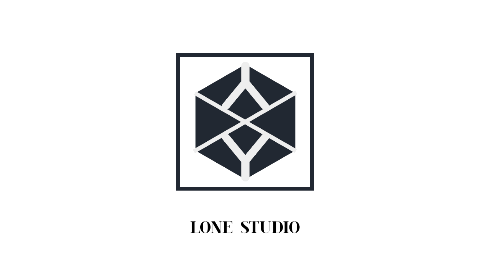

<a name="readme-top">

<br/>

<br />
<div align="center">
  <a href="https://github.com/zyx-0314/">
  <!-- TODO: If you want to add logo or banner you can add it here -->
    
  </a>
<!-- TODO: Change Title to the name of the title of your Project -->
  <h3 align="center">WD-Resume - XYLON SANTOS - TW04</h3>
</div>
<!-- TODO: Make a short description -->
<div align="center">
  This is the resume of Xylon Santos from TW04.
</div>

<br />

<!-- TODO: Change the zyx-0314 into your github username  -->
<!-- TODO: Change the WD-Template-Project into the same name of your folder -->


---

<br />
<br />

<!-- TODO: If you want to add more layers for your readme -->
<details>
  <summary>Table of Contents</summary>
  <ol>
    <li>
      <a href="#overview">Overview</a>
      <ol>
        <li>
          <a href="#key-components">Key Components</a>
        </li>
        <li>
          <a href="#technology">Technology</a>
        </li>
      </ol>
    </li>
    <li>
      <a href="#rules-and-principles">Rules and Principles</a>
    </li>
    <li>
      <a href="#resources">Resources</a>
    </li>
  </ol>
</details>

---

## Overview

<!-- TODO: To be changed -->
<!-- The following are just sample -->
Description of the project in details.

Guiding Question:
- What is the project - Resume
- Whats the purpose - The purpose is to make a simple resume using our current knowledge in HTML and CSS, also to improve our capabilities for the future projects 
- What are key components - The key components here are HTML, Sidebar, Main Content, and CSS
- What technology used and how it is used - The technology used are VSCode, HTML and CSS for the coding of the resume, GitHub for the repository, and WakaTime for the tracking of the project

### Key Components
<!-- TODO: List of Key Components -->
<!-- The following are just sample -->
- HTML
- Sidebar
- Main Content
- CSS

### Technology
<!-- TODO: List of Technology Used -->
![VSCode]


![GitHub]
![WakaTime]

## Rules and Principles
1. Always use ***WD-*** in the front of the Title of the Project for the Subject followed by your custom naming.
2. Do not rename any .html files; always use 'index.html' as the filename.
3. File Structure to follow

```
WD-ProjectName
└─ assets
|   └─ css
|   |   └─ style.css
|   └─ img
|   |   └─ fileWith.jpeg/.jpg/.webp/.png
|   └─ js
|       └─ script.js
└─ pages
|  └─ pageName
|     └─ assets
|     |  └─ css
|     |  |  └─ style.css
|     |  └─ img
|     |  |  └─ fileWith.jpeg/.jpg/.webp/.png
|     |  └─ js
|     |     └─ script.js
|     └─ index.html
└─ index.html
└─ readme.md
```

## Resources

<!-- TODO: Add References -->
| Title | Purpose | Link |
|-|-|-|
| Sample Title | Sample purpose would be here like this and this is the example of what it is. | trykolang.com |
